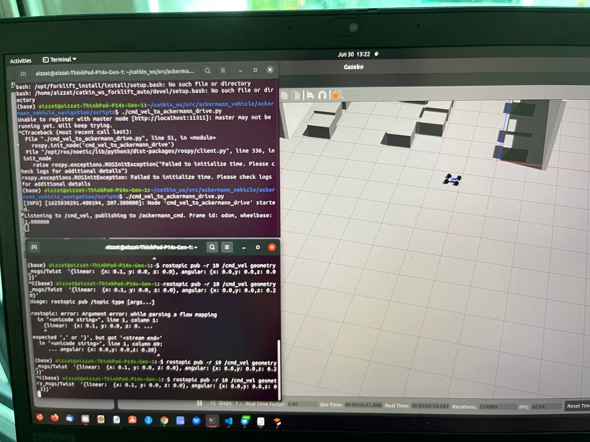

# This package is updated from original source to simulate the motion of the Ackerman drive in Gazebo

Since most of the previous repo used previous version of ROS, I faced compilation error in ROS Noetic version running Ubuntu 20.04. 
Some of the launch file issues due to the newer ROS version affected the launch file. The issue can be seen here:

https://answers.ros.org/question/122021/xacro-problem-invalid-param-tag-cannot-load-command-parameter-robot_description/

ackermann_vehicle (updated with ROS Noetic)
=================

ROS packages for simulating a vehicle with Ackermann steering

# This package is for developers only. 

## Installation (Noetic)
```
cd ~/catkin_ws/src
git clone https://github.com/aizzat/ackermann_vehicle/
sudo apt install ros-noetic-ackermann-msgs
cd ~/catkin_ws
rosdep install --from-paths src --ignore-src -r -y
catkin_make
```

## Installation (Melodic)
```
cd ~/catkin_ws/src
git clone https://github.com/aizzat/ackermann_vehicle/
sudo apt install ros-melodic-ackermann-msgs
cd ~/catkin_ws
rosdep install --from-paths src --ignore-src -r -y
catkin_make
```

## Running
`roslaunch ackermann_vehicle_gazebo ackermann_vehicle_noetic.launch`

## To test the steering command: 

```
#go to terminal to this python directory:
#/ackermann_vehicle/ackermann_vehicle_navigation/scripts/
# /ackermann_vehicle/ackermann_vehicle_navigation/scripts$
# Run the following commands:
./cmd_vel_to_ackermann_drive.py
```

This python file will wait for /cmd_vel inputs. You can test it with another terminal. For example:

```
rostopic pub -r 10 /cmd_vel geometry_msgs/Twist  '{linear:  {x: 0.1, y: 0.0, z: 0.0}, angular: {x: 0.0,y: 0.0,z: 0.2}}'
```



# Video - Please click on the image
[](https://youtu.be/nZZEMrxxz2o)

