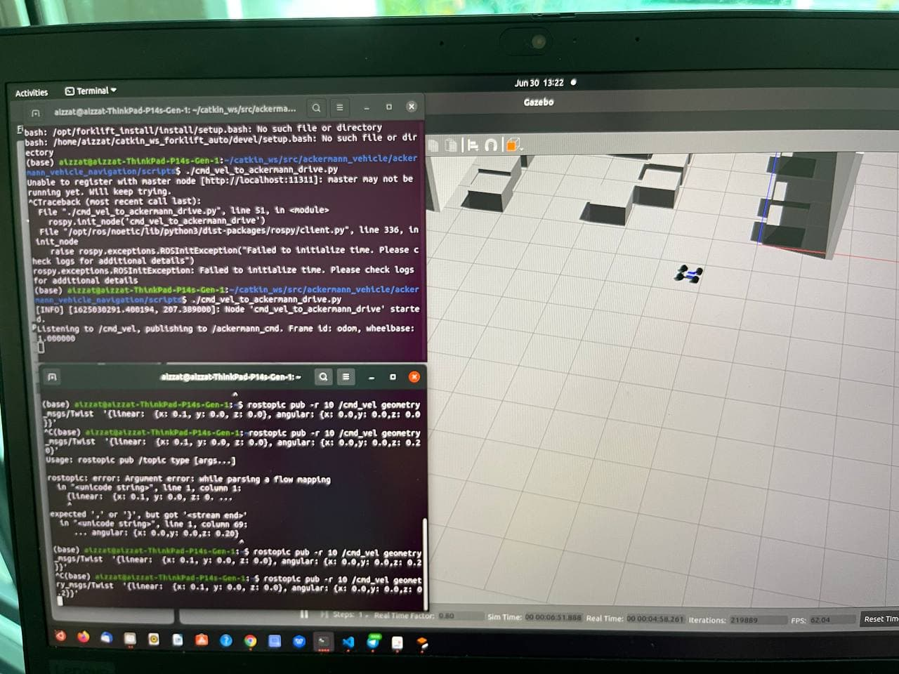

# ackermann_vehicle

ROS packages for simulating a vehicle with Ackermann steering in Gazebo
Classic. The repository is maintained at
<https://github.com/hdh7485/ackermann_vehicle> and keeps the original
Wunderkammer Laboratory attribution in the package metadata and source files.

## Support policy

| Platform | Status | Verification |
| --- | --- | --- |
| ROS Noetic / Ubuntu 20.04 / Gazebo Classic 11 | Supported | Build and headless launch smoke test in CI and `scripts/noetic_smoke_test.sh` |
| ROS Melodic / Ubuntu 18.04 / Gazebo Classic 9 | Legacy | Configuration is retained, but this release does not run a Melodic CI job |
| ROS 2 Humble / Ubuntu 22.04 | Core support | This `humble` branch builds and passes a headless command/description smoke test |

The original full-simulation release is ROS Noetic. The sensor variants require
the matching Gazebo sensor plugins; the default headless smoke test
intentionally exercises the base vehicle and controller path. The validated
controller path uses the root namespace (`namespace:=/`); custom namespaces are
not covered by that release's smoke test.

## ROS 2 core support

This is the distribution-specific `humble` branch. The ROS 2 package,
`ackermann_vehicle_ros2`, provides a maintained
`geometry_msgs/Twist` to `ackermann_msgs/AckermannDriveStamped` bridge and an
installed E-Maxx xacro for `robot_state_publisher`. It is built and
smoke-tested only against ROS 2 Humble in this branch. Build it from a fresh
Humble workspace:

```bash
mkdir -p ~/ros2_ws/src
cd ~/ros2_ws/src
git clone --branch humble https://github.com/hdh7485/ackermann_vehicle.git
cd ~/ros2_ws
source /opt/ros/humble/setup.bash
colcon build --packages-select ackermann_vehicle_ros2
source install/setup.bash
```

Run the bridge or the reproducible headless check:

```bash
ros2 launch ackermann_vehicle_ros2 cmd_vel_to_ackermann_drive.launch.py
ros2 topic pub --once /cmd_vel geometry_msgs/msg/Twist \
  '{linear: {x: 2.0}, angular: {z: 1.0}}'

ROS2_WS=$PWD bash src/ackermann_vehicle/scripts/ros2_smoke_test.sh
```

The smoke script defaults to ROS domain 203 so it does not attach to an
interactive graph; set `ACKERMANN_ROS_DOMAIN_ID` to override it. It rejects a
non-Humble environment so the branch cannot silently be tested against another
ROS distribution. ROS 2 Gazebo
world, sensor, and `ros2_control` controller adapters are not yet shipped:
Foxy/Humble need a Gazebo Classic adapter, while Jazzy needs a modern Gazebo
(`ros_gz`/Harmonic) adapter. See [`docs/ROS2_GAZEBO_PLAN.md`](docs/ROS2_GAZEBO_PLAN.md)
for those explicitly separate migration milestones.

## Installation (ROS Noetic)

```bash
mkdir -p ~/catkin_ws/src
cd ~/catkin_ws/src
git clone --branch noetic https://github.com/hdh7485/ackermann_vehicle.git
cd ~/catkin_ws
rosdep update
rosdep install --from-paths src --ignore-src -r -y
catkin_make
source devel/setup.bash
```

For a repeatable, display-free check from the workspace, run:

```bash
bash src/ackermann_vehicle/scripts/noetic_smoke_test.sh
```

The script starts a temporary ROS master, launches
`ackermann_vehicle_gazebo/launch/ackermann_vehicle_noetic.launch` with Gazebo
GUI disabled, and verifies that the Ackermann node and controller-manager
services are available. To run it manually with a visible simulator:

```bash
roslaunch ackermann_vehicle_gazebo ackermann_vehicle_noetic.launch
```

## Driving the simulated vehicle

The controller consumes `ackermann_msgs/AckermannDrive` on `/ackermann_cmd`.
The navigation package also provides a `cmd_vel` converter:

```bash
rosrun ackermann_vehicle_navigation cmd_vel_to_ackermann_drive.py
rostopic pub -r 10 /cmd_vel geometry_msgs/Twist \
  '{linear: {x: 0.1, y: 0.0, z: 0.0}, angular: {x: 0.0, y: 0.0, z: 0.2}}'
```

## Known Gazebo/controller issue coverage

The Noetic launch files now load the controller YAML before invoking the
Noetic `controller_manager/spawner`, pass an explicit service timeout, and
expose `gui`, `paused`, and `use_sim_time` arguments. This addresses the
controller-spawner race/failure mode reported in issue #3 and makes the
headless path used by issue #4 reproducible. The `joy` launch file now points
to the converter in `ackermann_vehicle_navigation`, where catkin installs it.

If a local Gazebo installation still fails to load the model, capture the
smoke-test log from `/tmp/ackermann_vehicle_ros_smoke` and include the ROS,
Gazebo, and controller versions in the issue report. Hardware-specific Hokuyo
topics are outside the base controller smoke test.

## Original research and attribution

This package was updated from earlier open-source Ackermann vehicle work. See
the Apache-2.0 license and the per-package changelogs for attribution and
maintenance history.



## Video

[](https://youtu.be/nZZEMrxxz2o)
